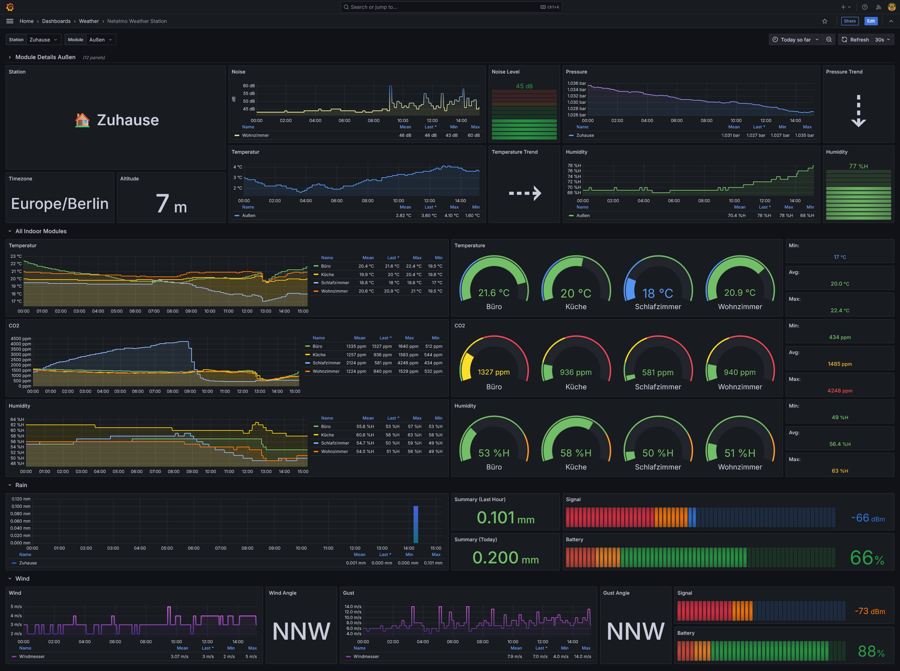

# netatmo-exporter


Netatmo Weather Station dashboard for Grafana based on Prometheus



## Installation

* Create a [Netatmo developer account](https://dev.netatmo.com/apidocumentation) and create an app there.
* Generate a refresh token in your app, scroll down to the "Token generator" and generate a new one with the appropriate
  scopes.
    * Scope "read_station" is sufficient for Weather Station data.
* Create a file called "config.yaml" or use Environment Variables and fill in your NETATMO_CLIENT_ID,
  NETATMO_CLIENT_SECRET and REFRESH_TOKEN.
    * An example config.yaml is provided below.
* Because of recent changes token information will be written to a local file called "token.json" next to the script.
  Make sure the user running the script has write permissions to that file.
    * If running via Docker, mount a volume to /app/token.json and the token file will be stored there.
    * You will find an example in the docker-compose.yml file.
* Environment Variables take precedence over everything else and will overwrite your config vars.
* The default is to search for a config file right next to the script, but you can point to any config file with the "
  -f" switch.

```yaml
interval: 600
loglevel: INFO
listen_port: 9126

netatmo:
  client_id: ""
  client_secret: ""
  refresh_token: ""
```

```yaml
services:
  netatmo-exporter:
    image: ghcr.io/karaktaka/netatmo-exporter
    restart: unless-stopped
    environment:
      - NETATMO_CLIENT_ID=
      - NETATMO_CLIENT_SECRET=
      - REFRESH_TOKEN=
      - INTERVAL=600
      - LOGLEVEL=INFO
      - LISTEN_PORT=9126
    volumes:
      - ./config.yaml:/app/config.yaml:ro
      - data:/app/data:rw

volumes:
  data:
```

## Prometheus Scraper

```yaml
---
scrape_configs:
  - job_name: netatmo_exporter
    static_configs:
      - targets: [ 'src:9126' ]
```
